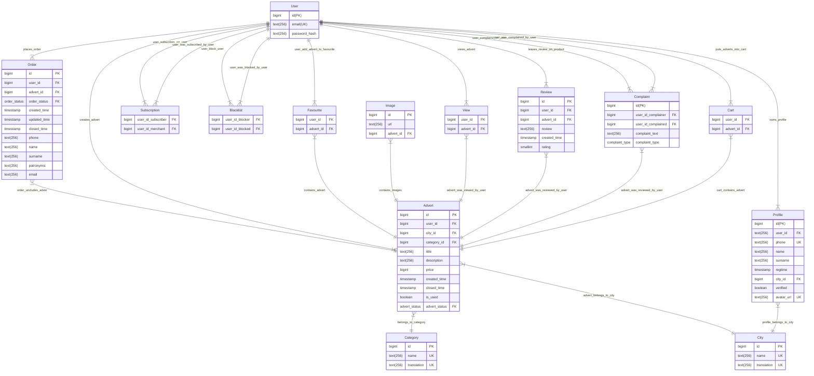

# Таблицы

## Advert

Таблица с полями объявления

| Название        | Тип       | Описание                                               |
|:----------------|:----------|:-------------------------------------------------------|
| <u>id</u>       | bigint    | Синтетический ключ                                     |
| user_id         | bigint    | Внешний ключ к пользователю, который создал объявление |
| city_id         | bigint    | Внешний ключ к городу, в котором создано объявление    |
| category_id     | bigint    | Внешний ключ к категории объявления                    |
| title           | text      | Краткое описание                                       |
| description     | text      | Полное описание                                        |
| price           | bigint    | Цена                                                   |
| created_time    | timestamp | Время создания объявления                              |
| closed_time     | timestamp | Время, когда объявление стало неактивыным              |
| is_used         | boolean   | Является ли товар подержанным                          |
| advert_status       | advert_status    | Cтатус объявления                      |

### Функциональные зависимости

{ id } -> user_id, city_id, category_id, title, description, price, creation_date, closed_time, is_used, advert_status 

### Нормальные формы

1. Все типы атрибутов атомарны => отношение находится в 1НФ.
2. Отношение находится в 1НФ, ключ является не составным => не имеем зависимости неключевых атрибутов от части ключа =>
   отношение находится в 2НФ.
3. Отношение находится в 2НФ и мы не имеем транзитивных ФЗ неключевых атрибутов от ключевых => отношение находится в
   3НФ.
   Или любой столбец зависит только от ключевых столбцов => отношение в 3НФ.
4. Требование НФБК - атрибуты составного ключа не должны зависеть от неключевых атрибутов.
   Тогда т.к. отношение находится в 3НФ и мы не имеем составного ключа => отношение находится в НФБК.

### Ограничения

* CONSTRAINT max_len_title CHECK (LENGTH(title) <= 256)

Ограничение max_len_title, что длина текста в столбце title не превышает 256 символов. 

* CONSTRAINT max_len_description CHECK (LENGTH(description) <= 256)

Ограничение max_len_description, что длина текста в столбце description не превышает 256 символов. 

* CONSTRAINT not_negative_price CHECK (price >= 0)

Ограничение not_negative_price проверяет, что значение в столбце price не отрицательно, то есть не меньше нуля.

* CONSTRAINT closed_time_is_after_created_time CHECK (closed_time >= created_time)

Ограничение closed_time_is_after_created_time убеждается в том, что значение в столбце closed_time больше или равно значению в столбце created_time, что проверяет тот факт, что время закрытия должно быть после времени создания.

## User

Таблица с данными пользователя

| Название       | Тип       | Описание                    |
|:---------------|:----------|:----------------------------|
| <u>id</u>      | bigint    | Синтетический ключ          |
| email          | text      | Почта                       |
| password_hash  | text      | Пароль в зашифрованном виде |
 

### ФЗ

{ id } -> email, password_hash

{ email } -> password_hash

### Нормальные формы

1. Все типы атрибутов атомарны => отношение находится в 1НФ.
2. Отношение находится в 1НФ, ключ является не составным => не имеем зависимости неключевых атрибутов от
   части ключа => отношение находится в 2НФ.
3. Отношение находится в 2НФ и мы не имеем транзитивных ФЗ неключевых атрибутов от ключевых => отношение
   находится в 3НФ. Или любой столбец зависит только от ключевых столбцов => отношение в 3НФ.
4. Требование НФБК - атрибуты составного ключа не должны зависеть от неключевых атрибутов.
   Тогда т.к. отношение находится в 3НФ и мы не имеем составного ключа => отношение находится в НФБК.

### Ограничения

* CONSTRAINT max_len_email CHECK (LENGTH(email) <= 256)

Ограничение max_len_email, что длина текста в столбце email не превышает 256 символов. 

* CONSTRAINT max_len_password_hash CHECK (LENGTH(password_hash) <= 256)

Ограничение max_len_password_hash, что длина текста в столбце password_hash не превышает 256 символов. 

## Profile

Таблица с данными профиля

| Название   | Тип       | Описание                                         |
|:-----------|:----------|:-------------------------------------------------|
| <u>id</u>  | bigint    | Синтетический ключ                               |
| user_id    | bigint    | Внешний ключ к пользователя, владеющего профилем |
| phone      | text      | Телефон                                          |
| name       | text      | Имя пользоавателя                                |
| surname    | text      | Фамилия пользователя                             |
| regtime    | timestamp | Дата регистрации                                 |
| city_id    | bigint    | Внешний ключ к городу                            |
| verified   | boolean   | Подтверждённый профиль                           |
| avatar_url | boolean   | Аватар пользователя                              |
 

### ФЗ

 { id } -> user_id, phone, name, surname, regtime, city_id, verified, avatar_url

 { user_id } -> phone, name, surname, regtime, city_id, verified, avatar_url

 { phone } -> user_id, name, surname, regtime, city_id, verified, avatar_url

 { avatar_url } -> user_id, phone, name, surname, regtime, city_id, verified

### Нормальные формы

1. Все типы атрибутов атомарны => отношение находится в 1НФ.
2. Отношение находится в 1НФ, ключ является не составным => не имеем зависимости неключевых атрибутов от
   части ключа => отношение находится в 2НФ.
3. Отношение находится в 2НФ и мы не имеем транзитивных ФЗ неключевых атрибутов от ключевых => отношение
   находится в 3НФ. Или любой столбец зависит только от ключевых столбцов => отношение в 3НФ.
4. Требование НФБК - атрибуты составного ключа не должны зависеть от неключевых атрибутов.
   Тогда т.к. отношение находится в 3НФ и мы не имеем составного ключа => отношение находится в НФБК. 

### Ограничения

* CONSTRAINT max_len_phone CHECK (LENGTH(phone) <= 256)

Ограничение max_len_phone, что длина текста в столбце phone не превышает 256 символов.

* CONSTRAINT max_len_name CHECK (LENGTH(name) <= 256)

Ограничение max_len_name, что длина текста в столбце name не превышает 256 символов.

* CONSTRAINT max_len_surname CHECK (LENGTH(surname) <= 256)

Ограничение max_len_surname, что длина текста в столбце surname не превышает 256 символов.

* CONSTRAINT max_len_email CHECK (LENGTH(email) <= 256)

Ограничение max_len_email, что длина текста в столбце email не превышает 256 символов.

* CONSTRAINT max_len_avatar_url CHECK (LENGTH(avatar_url) <= 256)

Ограничение max_len_avatar_url, что длина текста в столбце avatar_url не превышает 256 символов.

## Order

Таблица с данными заказа. Сущность заказа, лежащего в корзине или в истории заказов.

| Название     | Тип       | Описание                                             |
|:-------------|:----------|:-----------------------------------------------------|
| <u>id</u>    | bigint    | Синтетический ключ                                   |
| user_id      | bigint    | Внешний ключ к пользователю, который создал заказ    |
| advert_id    | bigint    | Внешний ключ к объявлению, на которое заказ размещен |
| order_status | order_status    | Cтатус заказа                                  |
| created_time | timestamp | Дата создания заказа                                 |
| updated_time | timestamp | Дата последнего обновления заказа                    |
| closed_time  | timestamp | Дата закрытия заказа                                 |
| phone        | text      | Телефон                                              |
| name         | text      | Имя пользоавателя                                    |
| surname      | text      | Фамилия заказчика                                    | 
| patronymic   | text      | Отчёство заказчика                                   | 
| email        | text      | Почта                                                | 

### ФЗ

{ id } -> user_id, advert_id,  order_status, created_time, updated_time, closed_time, phone, name, surname, patronymic, email

### Нормальные формы

1. Все типы атрибутов атомарны => отношение находится в 1НФ.
2. Отношение находится в 1НФ, ключ является не составным => не имеем зависимости неключевых атрибутов от
   части ключа => отношение находится в 2НФ.
3. Отношение находится в 2НФ и мы не имеем транзитивных ФЗ неключевых атрибутов от ключевых $\Rightarrow$ отношение
   находится в 3НФ.
   Или любой столбец зависит только от ключевых столбцов => отношение в 3НФ.
4. Требование НФБК - атрибуты составного ключа не должны зависеть от неключевых атрибутов.
   Тогда т.к. отношение находится в 3НФ и мы не имеем составного ключа => отношение находится в НФБК.

### Ограничения

* CONSTRAINT max_len_phone CHECK (LENGTH(phone) <= 256)

Ограничение max_len_phone, что длина текста в столбце phone не превышает 256 символов.

* CONSTRAINT max_len_name CHECK (LENGTH(name) <= 256)

Ограничение max_len_name, что длина текста в столбце name не превышает 256 символов.

* CONSTRAINT max_len_surname CHECK (LENGTH(surname) <= 256)

Ограничение max_len_surname, что длина текста в столбце surname не превышает 256 символов.

* CONSTRAINT max_len_patronymic CHECK (LENGTH(patronymic) <= 256)

Ограничение max_len_patronymic, что длина текста в столбце patronymic не превышает 256 символов.

* CONSTRAINT max_len_email CHECK (LENGTH(email) <= 256)

Ограничение max_len_email, что длина текста в столбце email не превышает 256 символов.

* CONSTRAINT updated_time_is_after_created_time CHECK (updated_time >= created_time)

Ограничение updated_time_is_after_created_time убеждается в том, что значение в столбце updated_time больше или равно значению в столбце created_time, что проверяет тот факт, что время обновление должно быть после времени создания.

* CONSTRAINT closed_time_is_after_created_time CHECK (closed_time >= created_time)

Ограничение closed_time_is_after_created_time убеждается в том, что значение в столбце closed_time больше или равно значению в столбце created_time, что проверяет тот факт, что время закрытия должно быть после времени создания.

## Advert Image

Таблица с путями до изображений на файловом сервере. В этой таблице хранятся только изображения для объявлений.

| Название   | Тип       | Описание                                                   |
|:-----------|:----------|:-----------------------------------------------------------|
| <u>id</u>  | bigint    | Синтетический ключ                                         |
| url        | text      | Путь к файлу                                               |
| advert_id  | bigint    | Внешний ключ к объявлению, к которому добавили изображение |  

### ФЗ

{ id } -> url, advert_id

{ url } -> advert_id

### Нормальные формы

1. Все типы атрибутов атомарны => отношение находится в 1НФ.
2. Отношение находится в 1НФ, ключ является не составным => не имеем зависимости неключевых атрибутов от
   части ключа => отношение находится в 2НФ.
3. Отношение находится в 2НФ и мы не имеем транзитивных ФЗ неключевых атрибутов от ключевых => отношение
   находится в 3НФ. Или любой столбец зависит только от ключевых столбцов => отношение в 3НФ.
4. Требование НФБК - атрибуты составного ключа не должны зависеть от неключевых атрибутов.
   Тогда т.к. отношение находится в 3НФ и мы не имеем составного ключа => отношение находится в НФБК.

### Ограничения

* CONSTRAINT max_len_url CHECK (LENGTH(url) <= 256)

Ограничение max_len_url, что длина текста в столбце url не превышает 256 символов. 

## Category

Таблица с категориями

| Название    | Тип       | Описание                             |
|:------------|:----------|:-------------------------------------|
| <u>id</u>   | bigint    | Синтетический ключ                   |
| name        | text      | Имя категории                        |
| translation | text      | Транслитерация категории. Необходима для формирования url, содержащего path параметры |

### ФЗ

{ id } -> name, translation

{ translation } -> name

{ name } -> translation

### Нормальные формы

1. Все типы атрибутов атомарны => отношение находится в 1НФ.
2. Отношение находится в 1НФ, ключ является не составным => не имеем зависимости неключевых атрибутов от
   части ключа => отношение находится в 2НФ.
3. Отношение находится в 2НФ и мы не имеем транзитивных ФЗ неключевых атрибутов от ключевых => отношение
   находится в 3НФ. Или любой столбец зависит только от ключевых столбцов => отношение в 3НФ.
4. Требование НФБК - атрибуты составного ключа не должны зависеть от неключевых атрибутов.
   Тогда т.к. отношение находится в 3НФ и мы не имеем составного ключа => отношение находится в НФБК.

### Ограничения

* CONSTRAINT max_len_name CHECK (LENGTH(name) <= 256)

Ограничение max_len_name, что длина текста в столбце name не превышает 256 символов. 

* CONSTRAINT max_len_translation CHECK (LENGTH(translation) <= 256)

Ограничение max_len_translation, что длина текста в столбце translation не превышает 256 символов.    

## City

Таблица с городами

| Название     | Тип       | Описание                             |
|:-------------|:----------|:-------------------------------------|
| <u>id</u>    | bigint    | Синтетический ключ                   |
| name         | text      | Название города                      |
| translation  | text      | Транслитерация города. Необходима для формирования url, содержащего path параметры    |

### ФЗ

{ id } -> name, translation

{ name } -> translation

{ translation } -> name

### Нормальные формы

1. Все типы атрибутов атомарны => отношение находится в 1НФ.
2. Отношение находится в 1НФ, ключ является не составным => не имеем зависимости неключевых атрибутов от
   части ключа => отношение находится в 2НФ.
3. Отношение находится в 2НФ и мы не имеем транзитивных ФЗ неключевых атрибутов от ключевых => отношение
   находится в 3НФ. Или любой столбец зависит только от ключевых столбцов => отношение в 3НФ.
4. Требование НФБК - атрибуты составного ключа не должны зависеть от неключевых атрибутов.
   Тогда т.к. отношение находится в 3НФ и мы не имеем составного ключа => отношение находится в НФБК.

### Ограничения

* CONSTRAINT max_len_name CHECK (LENGTH(name) <= 256)

Ограничение max_len_name, что длина текста в столбце name не превышает 256 символов. 

* CONSTRAINT max_len_translation CHECK (LENGTH(translation) <= 256)

Ограничение max_len_translation, что длина текста в столбце translation не превышает 256 символов. 

## View

Сводная таблица User -> Advert, отражающая просмотры объявлений. Если в таблице есть запись с какими-то user_id и advert_id, то это означает, что соответствующий пользователь просмотрел сответствующее объявление. Отсутствие такой записи может говорить о том, что соответствующий пользователь не просматривал сответствующее объявление

| Название   | Тип       | Описание                                                           |
|:-----------|:----------|:-------------------------------------------------------------------|
| user_id    | bigint    | Внешний ключ к пользователю, который добавил просмотрел объявление |
| advert_id  | bigint    | Внешний ключ к объявлению, которое пользователь просмотрел         |  

### ФЗ

Отсутствуют

### Нормальные формы

1. Все типы атрибутов атомарны => отношение находится в 1НФ.
2. Отношение находится в 1НФ, ключ является не составным => не имеем зависимости неключевых атрибутов от
   части ключа => отношение находится в 2НФ.
3. Отношение находится в 2НФ и мы не имеем транзитивных ФЗ неключевых атрибутов от ключевых => отношение
   находится в 3НФ. Или любой столбец зависит только от ключевых столбцов => отношение в 3НФ.
4. Требование НФБК - атрибуты составного ключа не должны зависеть от неключевых атрибутов.
   Тогда т.к. отношение находится в 3НФ и мы не имеем составного ключа => отношение находится в НФБК.

### Ограничения

* CONSTRAINT uniq_together_advert_id_user_id unique (user_id, advert_id)

Ограничение uniq_together_advert_id_user_id гарантирует уникальность комбинаций значений в столбцах user_id и advert_id. Это означает, что в таблице не может быть двух или более записей с одинаковым значением user_id и advert_id, что предотвращает ситуации, когда просмотр от одного и того же пользователя несколько раз засчитался для одного и того же товара.

## Favourite

Сводная таблица User -> Advert, отражающая список избранного

| Название   | Тип       | Описание                                                            |
|:-----------|:----------|:--------------------------------------------------------------------|
| user_id    | bigint    | Внешний ключ к пользователю, который добавил объявление в избранное |
| advert_id  | bigint    | Внешний ключ к объявлению, которое пользователь добавил в избранное |  

### ФЗ

Отсутствуют

### Нормальные формы

1. Все типы атрибутов атомарны => отношение находится в 1НФ.
2. Отношение находится в 1НФ, ключ является не составным => не имеем зависимости неключевых атрибутов от
   части ключа => отношение находится в 2НФ.
3. Отношение находится в 2НФ и мы не имеем транзитивных ФЗ неключевых атрибутов от ключевых => отношение
   находится в 3НФ. Или любой столбец зависит только от ключевых столбцов => отношение в 3НФ.
4. Требование НФБК - атрибуты составного ключа не должны зависеть от неключевых атрибутов.
   Тогда т.к. отношение находится в 3НФ и мы не имеем составного ключа => отношение находится в НФБК.

### Ограничения

* CONSTRAINT uniq_together_advert_id_user_id unique (user_id, advert_id)

Ограничение uniq_together_advert_id_user_id гарантирует уникальность комбинаций значений в столбцах user_id и advert_id. Это означает, что в таблице не может быть двух или более записей с одинаковым значением user_id и advert_id, что предотвращает ситуации, когда один пользователь несколько раз добавил в избранное один и тот же товар.

## Review

Таблица c отзывами. Отзывы пишут пользователи об объявлениях 

| Название     | Тип       | Описание                                                           |
|:-------------|:----------|:-------------------------------------------------------------------|
| <u>id</u>    | bigint    | Синтетический ключ                                                 |
| user_id      | bigint    | Внешний ключ к пользователю, который поставил оценку               |
| advert_id    | bigint    | Внешний ключ к объявлению, на которое поставили оценку             |
| review       | text      | Текст отзыва                                                       |
| created_time | timestamp | Дата создания заказа                                               |
| rating       | smallint  | Оценка заказа                                                      |

### ФЗ

{ id } -> user_id, advert_id, review, created_time, rating

{advert_id} -> user_id, review, created_time, rating

### Нормальные формы

1. Все типы атрибутов атомарны => отношение находится в 1НФ.
2. Отношение находится в 1НФ, ключ является не составным => не имеем зависимости неключевых атрибутов от
   части ключа => отношение находится в 2НФ.
3. Отношение находится в 2НФ и мы не имеем транзитивных ФЗ неключевых атрибутов от ключевых => отношение
   находится в 3НФ. Или любой столбец зависит только от ключевых столбцов => отношение в 3НФ.
4. Требование НФБК - атрибуты составного ключа не должны зависеть от неключевых атрибутов.
   Тогда т.к. отношение находится в 3НФ и мы не имеем составного ключа => отношение находится в НФБК.

### Ограничения

* CONSTRAINT uniq_together_advert_id_user_id unique (user_id, advert_id)

Ограничение uniq_together_advert_id_user_id гарантирует уникальность комбинаций значений в столбцах user_id и advert_id. Это означает, что в таблице не может быть двух или более записей с одинаковым значением user_id и advert_id, что предотвращает ситуации, когда один пользователь несколько раз написал отзыв и поставил оценку на один и тот же товар.  

* CONSTRAINT max_len_review CHECK (LENGTH(review) <= 256)

Ограничение max_len_review, что длина текста в столбце review не превышает 256 символов.

* CONSTRAINT rating_interval CHECK (rating >= 1 and rating <= 5)

Ограничение rating_interval проверяет, что значение в столбце rating находится в интервале от 1 до 5 включительно. Это означает, что оценка должна быть не меньше 1 и не больше 5, что соответствует диапазону оценок, используемому в системах рейтинга.

## Complaint

Таблица c жалобами. Жалобы пишут пользователи на других пользователей

| Название     | Тип       | Описание                                                           |
|:-------------|:----------|:-------------------------------------------------------------------|
| <u>id</u>    | bigint    | Синтетический ключ                                                 |
| user_id_complainer      | bigint    | Внешний ключ к пользователю, написал жалобу               |
| user_id_complained    | bigint    | Внешний ключ к пользователю, на которого написали жалобу             |
| complaint_text       | text      | Текст жалобы                                                       |
| complaint_type | complaint_type | Тип жалобы                                               |
                                                  

### ФЗ

{ id } -> user_id_complainer, user_id_complained, complaint_comment, complaint_type

### Нормальные формы

1. Все типы атрибутов атомарны => отношение находится в 1НФ.
2. Отношение находится в 1НФ, ключ является не составным => не имеем зависимости неключевых атрибутов от
   части ключа => отношение находится в 2НФ.
3. Отношение находится в 2НФ и мы не имеем транзитивных ФЗ неключевых атрибутов от ключевых => отношение
   находится в 3НФ. Или любой столбец зависит только от ключевых столбцов => отношение в 3НФ.
4. Требование НФБК - атрибуты составного ключа не должны зависеть от неключевых атрибутов.
   Тогда т.к. отношение находится в 3НФ и мы не имеем составного ключа => отношение находится в НФБК.

### Ограничения

* CONSTRAINT max_len_complaint_text CHECK (LENGTH(complaint_text) <= 2000)

Ограничение max_len_complaint_text, что длина текста в столбце complaint_text не превышает 2000 символов.

   

## Cart

Сводная таблица User -> Advert, отражающая список объявлений в корзине пользователя

| Название     | Тип       | Описание                                                           |
|:-------------|:----------|:-------------------------------------------------------------------|
| user_id      | bigint    | Внешний ключ к пользователя, который добавил в корзину             |
| advert_id    | bigint    | Внешний ключ к объявлению, которое было добавлено в корзину       |
                                   

### ФЗ

Отсутствуют

### Нормальные формы

1. Все типы атрибутов атомарны => отношение находится в 1НФ.
2. Отношение находится в 1НФ, ключ является не составным => не имеем зависимости неключевых атрибутов от
   части ключа => отношение находится в 2НФ.
3. Отношение находится в 2НФ и мы не имеем транзитивных ФЗ неключевых атрибутов от ключевых => отношение
   находится в 3НФ. Или любой столбец зависит только от ключевых столбцов => отношение в 3НФ.
4. Требование НФБК - атрибуты составного ключа не должны зависеть от неключевых атрибутов.
   Тогда т.к. отношение находится в 3НФ и мы не имеем составного ключа => отношение находится в НФБК.  

### Ограничения

* CONSTRAINT uniq_together_advert_id_user_id unique (user_id, advert_id)

Ограничение uniq_together_advert_id_user_id гарантирует уникальность комбинаций значений в столбцах user_id и advert_id. Это означает, что в таблице не может быть двух или более записей с одинаковым значением user_id и advert_id, что предотвращает ситуации, когда один пользователь несколько раз добавил в корзину один и тот же товар.  

## Blacklist

Сводная таблица User -> User, отражающая блокировки одних пользователей другими

| Название     | Тип       | Описание                                                           |
|:-------------|:----------|:-------------------------------------------------------------------|
| user_id_blocker      | bigint    | Внешний ключ к пользователя, который заблокировал          |
| user_id_blocked    | bigint    | Внешний ключ к пользователю, которого заблокировали          |
                                   

### ФЗ

Отсутствуют

### Нормальные формы

1. Все типы атрибутов атомарны => отношение находится в 1НФ.
2. Отношение находится в 1НФ, ключ является не составным => не имеем зависимости неключевых атрибутов от
   части ключа => отношение находится в 2НФ.
3. Отношение находится в 2НФ и мы не имеем транзитивных ФЗ неключевых атрибутов от ключевых => отношение
   находится в 3НФ. Или любой столбец зависит только от ключевых столбцов => отношение в 3НФ.
4. Требование НФБК - атрибуты составного ключа не должны зависеть от неключевых атрибутов.
   Тогда т.к. отношение находится в 3НФ и мы не имеем составного ключа => отношение находится в НФБК.  

### Ограничения

* CONSTRAINT uniq_together_advert_id_user_id unique (user_id_blocker, user_id_blocked)

Ограничение uniq_together_user_id_user_id гарантирует уникальность комбинаций значений в столбцах user_id_blocker и user_id_blocked. Это означает, что в таблице не может быть двух или более записей с одинаковым значением user_id_blocker и user_id_blocked, что предотвращает ситуации, когда один пользователь несколько раз заблокировал одного и того же пользователя.

## Subscription

Сводная таблица User -> User, отражающая список подписок и подписчиков. Если в таблице есть запись с какими-то user_id_subscriber и user_id_merchant, то это означает, что соответствующий пользователь подписался на соотвествующего пользователя. Отсутствие такой записи может говорить о том, что соответствующий пользователь не подписан на сответствующего пользователя.

| Название           | Тип       | Описание                                                |
|:-------------------|:----------|:--------------------------------------------------------|
| user_id_subscriber | bigint    | Внешний ключ к пользователю, который подписался |
| user_id_merchant   | bigint    | Внешний ключ к объявлению, на которого подписались      |  

### ФЗ

Отсутствуют

### Нормальные формы

1. Все типы атрибутов атомарны => отношение находится в 1НФ.
2. Отношение находится в 1НФ, ключ является не составным => не имеем зависимости неключевых атрибутов от
   части ключа => отношение находится в 2НФ.
3. Отношение находится в 2НФ и мы не имеем транзитивных ФЗ неключевых атрибутов от ключевых => отношение
   находится в 3НФ. Или любой столбец зависит только от ключевых столбцов => отношение в 3НФ.
4. Требование НФБК - атрибуты составного ключа не должны зависеть от неключевых атрибутов.
   Тогда т.к. отношение находится в 3НФ и мы не имеем составного ключа => отношение находится в НФБК.

### Ограничения

* CONSTRAINT uniq_together_user_id_user_id unique (user_id_subscriber, user_id_merchant)

Ограничение uniq_together_user_id_user_id гарантирует уникальность комбинаций значений в столбцах user_id_subscriber и user_id_merchant. Это означает, что в таблице не может быть двух или более записей с одинаковым значением user_id_subscriber и user_id_merchant, что предотвращает ситуации, когда один пользователь несколько раз подписался на другого.

***

# ERDiagram

Код **mermaid** диаграммы представлен
ниже. 

